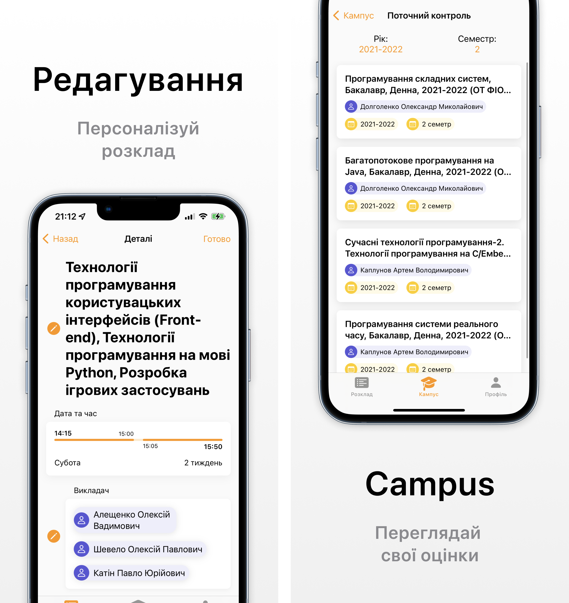
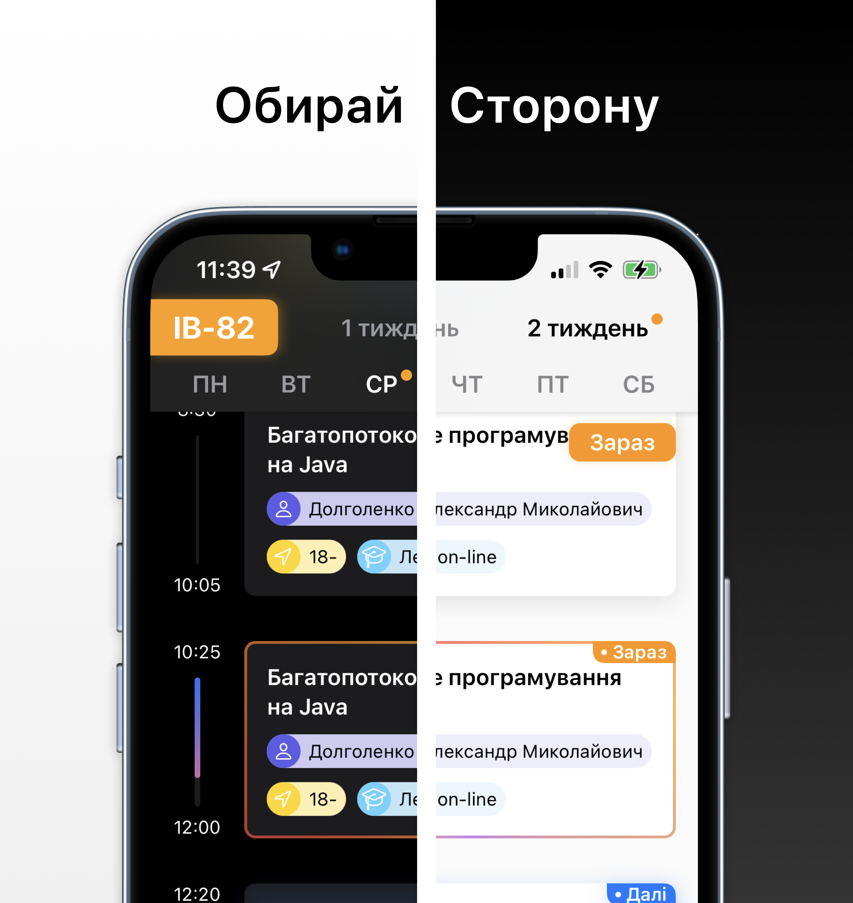

# KPIHub

An iOS application for KPI students for schedule and campus.

This application works in cooperation with [server](https://github.com/ddanilyuk/KPIHubServer) written by me using Vapor. All detailed information about the server can be found in the README.md of server repository.

## This app provides

- Practical design for schedule with convenient navigation between weeks and days
- Campus study sheet integration
- Schedule personalization (Editing elective disciplines)

##  Used technologies

- SwiftUI (No UIKit view in app)
- [The Composable Architecture](https://github.com/pointfreeco/swift-composable-architecture)
- [TCACoordinators](https://github.com/johnpatrickmorgan/TCACoordinators) (Flexible TCA navigation for SwiftUI)
- [vapor-routing](https://github.com/pointfreeco/vapor-routing) (Receiving API client for free from server library)

## Demo

## Plans

> Feel free to write me if you have an feature idea or u want to implement something. All contacts in my profile.

### Architecture

- [ ] Use new SwiftUI 4 Navigation Stacks
- [ ] Update TCA for async / await (this feauture is not released by point-free yet)

### Rozklad

- [ ] Exams schedule
- [ ] Teachers schedule
- [ ] Ability to check other groups schedule
- [ ] Widget
- [ ] Check rozklad updates on app start 

### Campus

- [ ] Exams marks
- [ ] Attestations
- [ ] API integration (no used parsing)

## How to build?

This application use routing for API client from server written with swift. There are **two** variants to get routing code:

- Clone iOS app and Server app in to one folder
- Use SPM on iOS app to add library `Routes` from server repository
